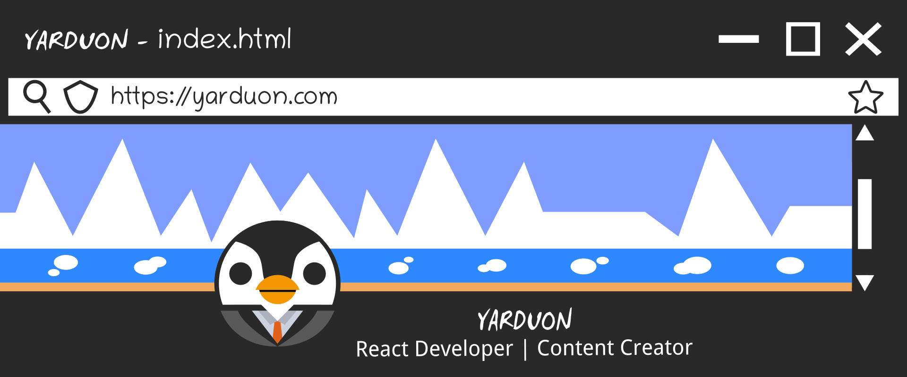

 

 
 

I'm Javier Alarcón, from Canary Islands, Spain and I've been a Full-stack Junior Developer since 2020. I describe myself as creative, self-taught, decisive, positive, reliable and a dreamer. I love to create things for the world and improve our lives.

I am currently studying a Certificate of Higher Education (CertHE) of Web Development at <a href="https://cifpcesarmanrique.es/">CIFP César Manrique</a>, and I am looking right now to study and work in Canada. I am developing <a href="https://github.com/j-alarcon/mathcard">Mathcard</a>, a beautiful calculator totally customizable.

    
    
    
    
    
        
    
    
    
    
      
    
        
    
    
    
    
        

 

 

 

You are not allowed to modify, use my code or resources for your own projects without my consent, even if it's everything is public. If you do not follow the preceding, I might take legal actions against you.
