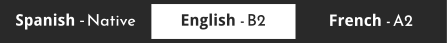

&nbsp;
&nbsp;
&nbsp;
&nbsp;
&nbsp;
&nbsp;
&nbsp;

 
 

I'm Yarduon from the Canary Islands, Spain, and I've been a developer since 2020. I describe myself as a creative, self-educated, collaborative, flexible, driven, and resourceful person. My passion is to produce software solutions that enhance our quality of life and positively impact the world.

I love brainstorming and exploring new ideas that continuously pop up in my mind. The excitement of moving these concepts from simple thoughts to tangible creations is second to none. Nothing beats the satisfaction of putting a vision into practice and sharing it with others.

My current focus is to create exciting new projects for my portfolio, and I'm also actively looking for new adventures. I am currently developing <a href="https://github.com/yarduon/mathcard">Mathcard</a>, a beautiful pseudo-scientific calculator totally customizable.

 

 

    

 
 
 

Colorful counter to quantify scores of different teams with a timer

Simple pretty landing page about bees

Strategic game in which you can combine elements to generate differents reactions

Beautiful pseudo-scientific calculator totally customizable

 
 

 
 
 

You are not allowed to modify, use my code or resources for your own projects without my consent, even if it's everything is public. If you do not follow the preceding, I might take legal actions against you.
